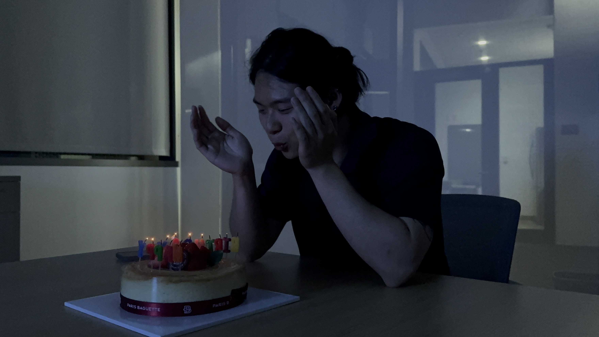
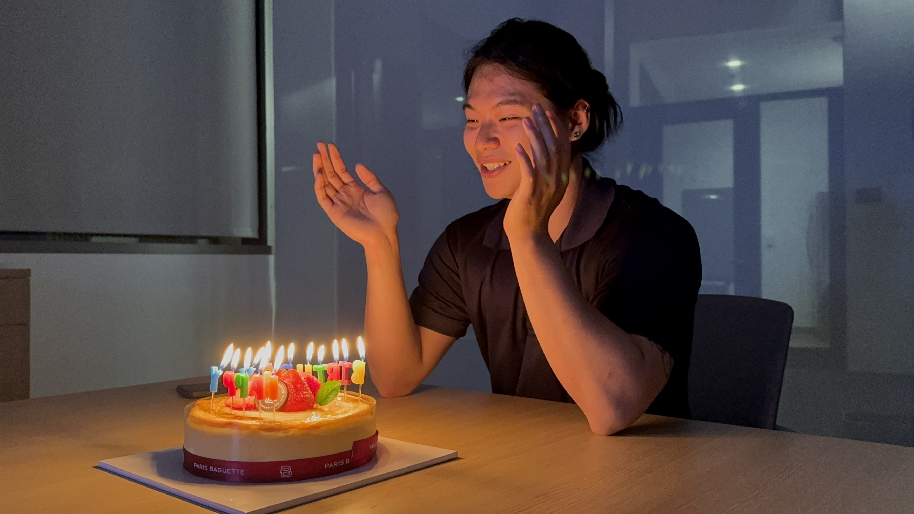

## About Me

Hi! I am Jiacheng Qiu, a Master student (2023.09,--2025.06) of  Halıcıoğlu Data Science Institute (HDSI) at the <a href="https://ucsd.edu/">University of California, San Diego (UCSD)</a>. My supervisor is <a href="https://www.tauhidurrahman.com/">Prof. Tauhidur Rahman. 

Currently, I am interested in Computer Vision and Multi-modal learning.
My research is centered on Event-based Vision, especially in Synthetic Event Generation and Motion-related Tasks. 

I am actively looking for PhD's positions for 25 Fall. If you want to know more about me, do not feel hesitated to email me!  :)



## Academic Experience
- 2024.04 - present, Research Assistant, <a href="https://mosaic-laboratory.github.io">MOSAIC Lab, Supervisor: <a href="https://www.tauhidurrahman.com">Tauhidur Rahman</a> 
  Research area: Event-based vision and Multi-modal learning

## Education Experience
- 2023.06 - 2025.06, M.S., Data Science, <a href="https://ucsd.edu/">UCSD</a>, USA
- 2019.09 - 2023.06, B.S., Finance, Mathematics, Economics, <a href="https://www.kean.edu/">KU</a>, USA

## Honors and Awards
- 2023.06, Outstanding Graduate Award
- 2022.12, Dean’s Scholarship

<!-- ## Life Moments

    
    <!-- Add more images as needed -->

 -->

<head>
    <meta charset="UTF-8">
    <meta name="viewport" content="width=device-width, initial-scale=1.0">
    <title>Gallery</title>
    
</head>
<body>
    <h2>Moments</h2>
    

        <!-- Each item in the gallery includes an image and a description -->
        

            
            
Birthday celebration

        

        

            
            
Another Birthday Moment

        

        

            
            
Fun at the party

        

        <!-- Add more items as needed -->
    

</body>
</html>

